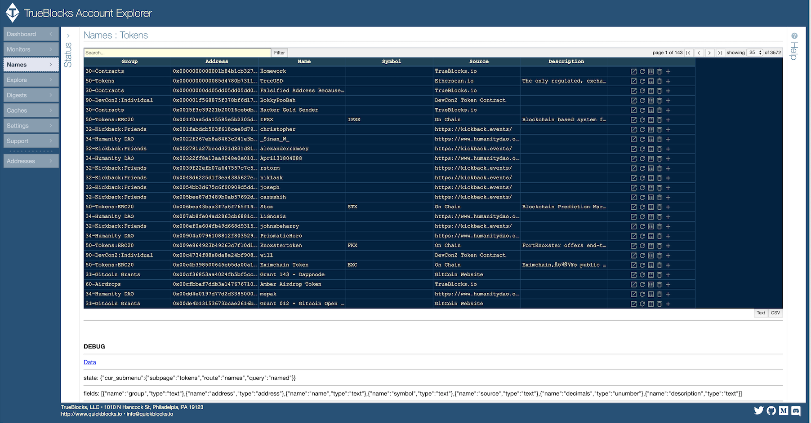

# TrueBlocks Explorer


[](https://quickblocks.io/)
[](https://github.com/Great-Hill-Corporation/trueblocks-explorer)
[](https://reactjs.org/)
[](https://twitter.com/quickblocks?lang=es)

TrueBlocks creates an index of Ethereum addresses on commerial-grade hardware providing fast access to **everything that ever happened** to your accounts on your own machine. This enables a fully decentralized blockchain browsing experience -- and this translates directly into _privacy-preserving user-centric_ browsing. We can't invade your privacy because we can't see what you're doing!

---

## Installing

### Installing TrueBlocks Core and Core Applications

First, let's test your build environment. From a command line, type:

```
cmake version
go --version
```

If both commands return without error, skip to the next section. If either of the commands fails, please see these [installation instructions](https://github.com/Great-Hill-Corporation/trueblocks-core/blob/master/src/other/install/INSTALL.md) on preparing the build environment.

### Building TrueBlocks Core and Chifra

`Chifra` is the core application of TrueBlocks' back end. Similar to `git` it provides access to all of TrueBlocks' commands. Assuming you're build environment is properly configured, complete these commands from the root of your `Development` folder:

```
git clone https://github.com/Great-Hill-Corporation/trueblocks-core
cd trueblocks-core
mkdir build && cd build
cmake ../src
make
```

If `cmake` doesn't run and/or the build breaks when it tries to run the `go` command, see the above link. The build will take a while to complete, but you only have to do it once, so be patient.

After the build completes, you will be in the folder `./trueblocks-core/build`. Type these commands to test the installation:

```
cd ../bin
./chifra --version
```

You should get a valid version.

**Important:** You must add the TrueBlocks `./bin` folder your `$PATH`. If you don't know how to do that, this software isn't for you. If you do know how to do that, do so now.

### One Final Test

If everything is working properly and you've added TrueBlocks to your \$PATH, try this command:

```
> chifra --version
```

should respond with the current version of the tools.

---

### Installing the User Interface, API, and Documentation

Once you've installed the core, you may install the Explorer interface, the api (which requires the above tools), and the documentation server. All of this functionality is maintained in a single repo (this one). Again, from your development folder:

```
git clone git@github.com:TrueBlocks/trueblocks-explorer.git
cd trueblocks-explorer
git checkout develop
yarn install
yarn start
```

Your should see the **TrueBlocks Account Explorer** screen:



## Requirements

- **Note:** In order for the TrueBlocks to work, you must have access to an Ethereum node with **--tracing** enabled. TrueBlocks defaults to using Parity at the RPC endpoint http://localhost:8545, but you may use any node supporting tracing and any endpoint (Infura, Quiknodes, for example). Performance will be _greatly reduced_ if you use a remote server. A good solution to this problem is to run a node on the [dAppNode](https://dappnode.io/) or [Ava.do](https://ava.do/) platforms and use the [TrueBlocks docker image](http://github.com/Great-Hill-Corporation/trueblocks-docker).

## Getting Data on the Command Line

Assuming TrueBlocks is installed correctly, and that you have a node endpoint, and that the tools are in your \$PATH, you should be able to run the following command at a command prompt:

```
> chifra blocks 100
```

and get valid data from your node:

```
{
  "data": [
    {
      "gasLimit": 5000,
      "gasUsed": 0,
      "hash": "0xdfe2e70d6c116a541101cecbb256d7402d62125f6ddc9b607d49edc989825c64",
      "blockNumber": 100,
      "parentHash": "0xdb10afd3efa45327eb284c83cc925bd9bd7966aea53067c1eebe0724d124ec1e",
      "miner": "0xbb7b8287f3f0a933474a79eae42cbca977791171",
      "difficulty": 17916437174,
      "price": 0,
      "finalized": true,
      "timestamp": 1438270443,
      "transactions": []
    }
  ]
}
```

If that works, try this command:

```
> chifra blocks 0-latest:10000
```

Which exports every 10,000th block in the chain from first to last. Or, try this command:

```
> chifra blocks --uniq_tx 4001001
```

Which will show every address that appears anywhere in block 4,001,001. There are literally hundreds of other options to `chifra` and the other tools. See the documentation.

## Getting Data from the API

The TrueBlocks Explorer uses an API to access data provided (that is ultimately provided by `chifra`). Assuming everything is installed correctly and you've started the API server, you should be able to get the same data from the API:

```
> curl "http://localhost:8080/blocks?blocks=4001001&uniq_tx"
```

which will return the same as the above command (in JSON format -- everything from the API is returned as JSON unless you add `&fmt=txt` or `&fmt=csv` to your request.

For documentation on the API, you may do this:

```
> open "http://localhost:8090"
```

## Scraping the Chain

To begin the process of creating the address index, enter this command in a seperate window or `tmux` session. You will need to keep this process running continually to keep the index fresh.

```
> chifra scrape
```

- **Note:** This requires a _--tracing node_ to produce a full list of appearances. It will work (with some configuration changes) on non-tracing nodes, but many of the appearances will not be included. Note also, this takes a loooong time. Depending on your setup at least 2-3 days (local node endpoint) or significantly longer (remote, rate-limited RPC endpoints).

## Examples:

There are many, many options to use TrueBlocks. Here are a few:

- Get a list of every **appearance** anywhere on the chain for a specific address:

  - `curl http://localhost/list?address=0xfB6916095ca1df60bB79Ce92cE3Ea74c37c5d359`

- Get full details of every **transaction** for specific address to CSV:

  - `curl http://localhost/export?address=0xfB6916095ca1df60bB79Ce92cE3Ea74c37c5d359&fmt=csv`

- Using the command line, get tab-seperated list of every **log** that an address appears in:

  - `> chifra export --logs 0xfB6916095ca1df60bB79Ce92cE3Ea74c37c5d359 --fmt txt`

- Get JSON details of every **trace** in which a specific address appears:

  - `curl http://localhost/export?trace&address=0xfB6916095ca1df60bB79Ce92cE3Ea74c37c5d359`

- Get the name of an address:

  - `chifra names 0xfB6916095ca1df60bB79Ce92cE3Ea74c37c5d359` // Ethereum Tip Jar
  - `chifra names 0x6b175474e89094c44da98b954eedeac495271d0f` // DAI
  - `curl http://localhost/names?0xfB6916095ca1df60bB79Ce92cE3Ea74c37c5d359` // TrueBlocks Tip Jar

- From the command line, get tab-seperated text of every **balance change in US dollars** for an addresses:

  - `> chifra export --balances --deltas 0xfB6916095ca1df60bB79Ce92cE3Ea74c37c5d359 --dollars`

- Get balance of DAI for an address at current block on command line:

  - `chifra tokens 0x6b175474e89094c44da98b954eedeac495271d0f (ethNames -ca true)`

There are literally hundreds of other options. Also, you may specify as many addresses as you wish on each command.

## FAQ

### I'm running geth, do I need to run Parity instead?

Yes - Parity delivers the necessary articulated traces so that TrueBlocks can build its address index. We don't yet support Geth.

### More coming soon...

## Troubleshooting

### More coming soon...

## Contributing

Please read [CONTRIBUTING.md](CONTRIBUTING.md) for details on our code of conduct, and the process for submitting pull requests to us.

## Authors

- **Thomas Jay Rush** - [tjayrush](https://github.com/tjayrush)
- **Ed Mazurek** - [wildmolasses](https://github.com/wildmolasses)

See also the list of [contributors](https://github.com/Great-Hill-Corporation/trueblocks-docker/contributors) who participated in this project.

## License

Licensing information pending...

## References
